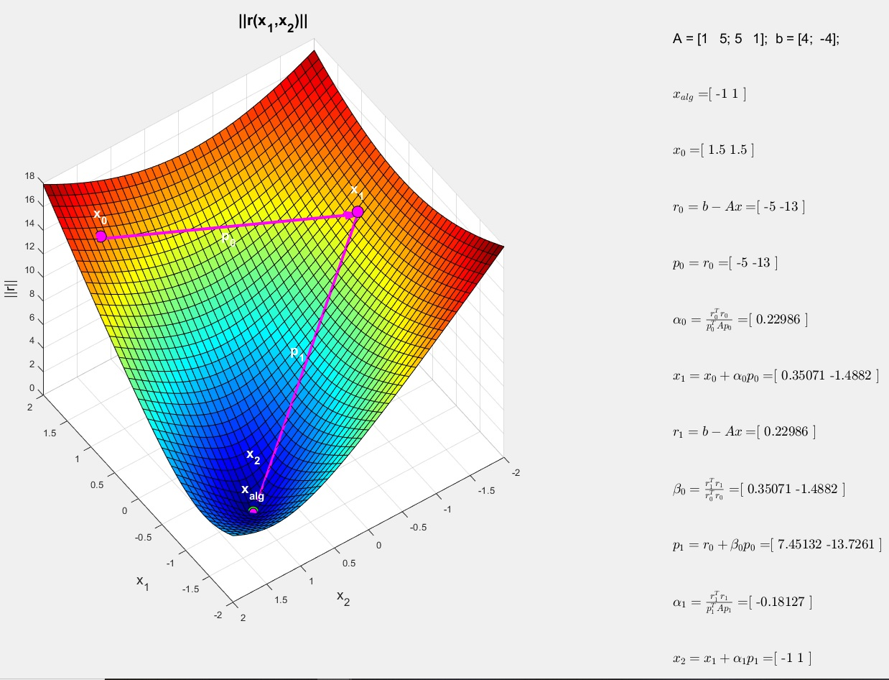

Celem tego zadania jest zaimplementowanie metody gradientów sprzężonych oraz stworzenie wizualizacji, która pomoże zrozumieć, jak ta metoda działa. Student powinien zaimplementować algorytm, który będzie rozwiązywał układy równań liniowych, a następnie przedstawić wizualizację kolejnych kroków algorytmu.

 

Kroki do wykonania:
Zaimplementuj algorytm metody gradientów sprzężonych w dowolnym języku programowania, np. Python, MATLAB, R, itp. Algorytm powinien przyjmować jako dane wejściowe macierz A, wektor b oraz opcjonalnie punkt startowy x0 i liczbę maksymalnych iteracji.
Przetestuj algorytm na przykładowych układach równań liniowych o różnych rozmiarach i sprawdź, czy algorytm działa poprawnie.
Stwórz wizualizację przedstawiającą działanie algorytmu metody gradientów sprzężonych. Wizualizacja powinna pokazać, jak zmieniają się wartości niewiadomych x, y (oraz ewentualnie kolejnych zmiennych) w kolejnych iteracjach. Można to zrobić, na przykład, tworząc animację lub interaktywny wykres, na którym każda iteracja algorytmu będzie oznaczona jako punkt.
Zastosuj wizualizację do przedstawienia, jak metoda gradientów sprzężonych działa dla różnych układów równań liniowych. Zwróć uwagę na różne parametry, takie jak liczba iteracji, tempo zbiegania do rozwiązania, czy wybór punktu startowego.
 

Wskazane jest również dodanie do wizualizacji porównanie z innymi metodami rozwiązywania układów równań, takimi jak metoda Gaussa-Seidela czy metoda gradientu prostego, aby pokazać różnice w szybkości zbiegania do rozwiązania.Wizualizacja może zawierać informacje o wartościach gradientów, sprzężonych gradientów, alfa, beta itp. w kolejnych iteracjach, aby lepiej zrozumieć, jak algorytm działa.

 

Do tworzenia wizualizacji w MATLAB, można użyć funkcji plot, scatter, surf, contour itp., w zależności od wymiarów problemu. Dla animacji można użyć funkcji animatedline lub tworzyć serię klatek z wykresów i zapisywać je jako plik GIF lub film

